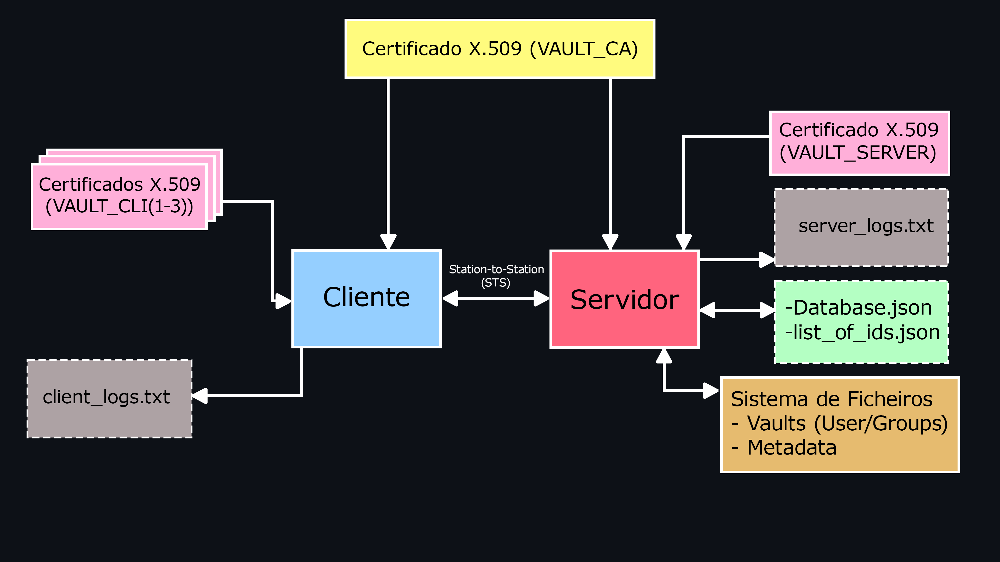

# Secure Vault Service


## Índice


- [Introdução](#introdução)
- [Arquitetura Geral do Sistema](#arquitetura-geral-do-sistema)
- [Divisão do Sistema](#divisão-do-sistema)
- [Autenticação e Identificação do Utilizador](#autenticação-e-identificação-do-utilizador)
- [Armazenamento de Ficheiros](#armazenamento-de-ficheiros)
- [Gestão de Utilizadores e Certificados](#gestão-de-utilizadores-e-certificados)
- [Acesso e Controlo de Permissões](#acesso-e-controlo-de-permissões)
- [Funcionamento dos Comandos](#funcionamento-dos-comandos)
  - [Comandos de Gestão de Ficheiros](#comandos-de-gestão-de-ficheiros)
  - [Comandos de Partilha](#comandos-de-partilha)
  - [Comandos de Gestão de Grupos](#comandos-de-gestão-de-grupos)
  - [Regras e Casos Particulares](#regras-e-casos-particulares)
- [Formato das Mensagens](#formato-das-mensagens)
- [Testes e Validação](#testes-e-validação)
- [Possíveis Melhorias e Trabalho Futuro](#possíveis-melhorias-e-trabalho-futuro)
- [Conclusão](#conclusão)
---


### Introdução


Neste projeto foi-nos proposto o desenvolvimento de um serviço de "Cofre Seguro" que permitisse aos membros de uma organização armazenar e partilhar ficheiros de texto com garantias essenciais de segurança como: **autenticidade**, **integridade** e **confidencialidade**; a solução implementada dá-nos a garantia destas três propriedades e integra duas das valorizações requisitadas: a utilização de **BSON** para estruturar as mensagens de protocolo e um sistema de **logging**.


### Arquitetura Geral do Sistema

  

Para garantir que possuímos um canal seguro decidimos implementar o protocolo **"Station-to-Station"**. Optamos por utilizar este protocolo visto que a lógica de certificados digitais permite não só obter a **troca segura** de uma chave secreta através do protocolo **"Diffie-Hellman"**, mas também a **autenticação mútua** de ambas as partes envolvidas. Assim temos garantias de que o nosso canal se encontra invulnerável a ataques "Man in the Middle".





### Divisão do Sistema


- **Cliente**: Interface com o utilizador, encriptação/desencriptação de ficheiros, comunicação com o servidor.

- **Servidor**: Gestão de pedidos, armazenamento de ficheiros (Vaults pessoais, de grupo e metadados) e controlo de permissões.

- **Certificados**: Armazenamento de certificados e chaves para autenticação.


### Autenticação e Identificação do Utilizador


O sistema recorre à autenticação mútua com certificados X.509, verificados automaticamente durante o handshake TLS : 


 1. O cliente fornece o seu certificado digital para o servidor.

 2. O servidor verifica: 

       1. A **assinatura digital**, isto é, verifica se o certificado digital foi assinado por uma CA confiável.

       2. A **validade temporal**, isto é, se o certificado ainda não expirou.

       3. Verifica também a **autoridade certificadora (CA)**, para garantir que esta é de confiança.


As mensagens são serializadas em JSON e transmitidas através de **ObjectInputStream** e **ObjectOutputStream** sobre o canal TLS. A cada operação, é validada a correspondência entre o certificado da sessão e o ID do utilizador.


Este mecanismo assegura **confidencialidade**, **integridade** e **autenticidade** em todas as comunicações.


### Armazenamento de Ficheiros


Quando um utilizador pretende armazenar um ficheiro, o cliente gera uma **chave simétrica** que será usada para encriptar o conteúdo. Esta chave é, posteriormente, encriptada com a **chave pública** do utilizador. O ficheiro encriptado, juntamente com a chave também encriptada, é enviado para o servidor, que o armazena na vault correspondente, mantendo os metadados separados do conteúdo.


A recuperação de ficheiros inicia-se através de um pedido do utilizador. O servidor verifica se este possui as **permissões** necessárias para o efetuar. Se autorizado, o ficheiro e a chave encriptada são enviados ao cliente. A chave é desencriptada com a **chave privada** do utilizador, permitindo o acesso ao conteúdo do ficheiro.


### Gestão de Utilizadores e Certificados


Cada utilizador é identificado através de um certificado **X.509** único, que inclui vários atributos identificadores. Entre estes destacam-se:


- `PSEUDONYM` 

- `CN (Common Name)`

- `OU (Organizational Unit)`


Os certificados são emitidos pela autoridade certificadora **VAULT_CA**, e a verificação da autenticidade é feita através da validação da cadeia de certificação.

É também importante realçar que o campo **PSEUDONYM** é utilizado para definir o identificador único de cada cliente.


### Acesso e Controlo de Permissões


O controlo de acesso segue as seguintes diretivas:


- **Permissões**: `R`, `W`, `RW`

- Apenas os **donos** podem alterar permissões

- Grupos têm permissões definidas por **utilizador**

- A revogação é feita através da **remoção** das chaves


### Funcionamento dos Comandos


Implementamos todos os comandos, no entanto apenas vamos explicar os que consideramos mais relevantes.


### Comandos de Gestão de Ficheiros

---

 - `add ` 


   - Consideramos este comando essencial, pois permite perceber como o conteúdo é encriptado no cliente antes de ser enviado para o servidor. 


   - **Cliente:**  

       - O cliente gera uma `file_key` (256 bits aleatórios) e encripta-a com a sua própria chave pública.  

       - De seguida, encripta o conteúdo do ficheiro utilizando a `file_key` gerada no passo anterior.  

       - Para finalizar, envia a mensagem ao servidor no formato BSON, seguindo a seguinte estrutura:  


       ```json
       {
          "command": "ADD-FILE",
          "file_name": file_name,
          "user_id": user_id,
          "file_content": encrypted_content,
          "file_key": encrypted_file_key
       }
       ```


   - **Servidor:**  

       - O servidor verifica se o utilizador já possui uma vault própria e cria uma nova caso esta ainda não exista.  

       - De seguida, armazena a `file_key` encriptada na pasta **metadata**, que guarda para cada ficheiro a chave associada aos utilizadores que o podem aceder.  

       - Como o utilizador está a aceder à sua própria vault, são atribuídas permissões `RW` (leitura e escrita).  

       - Por fim, atualiza a base de dados com as informações da vault (caso esta tenha sido criada) e do ficheiro adicionado (`file_id`, `file_name`, `permissions`).  


---


- `list [-u user-id | -g group-id]` 

  - Consideramos este comando essencial, pois permite perceber como as permissões são verificadas e como os ficheiros estão organizados.


  - **Cliente:**  

       - O cliente envia uma mensagem no formato BSON que indica o tipo de comando a ser executado(`LIST-FILES` ou `LIST-FILES-GROUP`).  

       - Esta mensagem inclui também `user_id` do próprio utilizador e, dependendo do caso, o `user_id` do utilizador cujos ficheiros se pretende listar ou o `group_id` do grupo a ser listado.  


  - **Servidor:**  

       - O servidor começa por verificar todas as vaults e identificar todos os ficheiros aos quais o utilizador tem permissão de acesso.  

       - De seguida, filtra os ficheiros pertencentes ao utilizador ou grupo especificado e adiciona-os a uma lista.  

       - Para finalizar, retorna essa lista ao cliente.  


---


- `read `  

  - Consideramos este comando essencial para perceber como o cliente utiliza a 

   chave privada para desencriptar a chave do ficheiro e, em seguida, o seu conteúdo.


   - **Cliente:**  

       - O cliente envia uma mensagem no formato BSON com o comando `FILE-READ`.  

       - Esta mensagem inclui também `user_id` do próprio utilizador e o `file_id` do ficheiro que o utilizador pretende ler.

  

  - **Server**

      - O servidor procura nas vaults até encontrar o ficheiro que o utilizador pretende ler.

      - De seguida verifica se o utilizador tem permissões de leitura sobre esse ficheiro.

      - Caso tenha permissão, o servidor recupera a chave encriptada associada ao ficheiro nos metadados e envia-a ao cliente.  


  - **Client** 

    - O cliente utiliza a sua chave privada para desencriptar a chave encriptada que recebeu do servidor.

    - Com a chave desencriptada o utilizador deo conteúdo do ficheiro.


---
---


### Comandos de Partilha

---

- `share   ` 

Este comando requer um processo mais complexo para garantir a confidencialidade na partilha de ficheiros uma vez que temos que garantir que o servidor não tenha acesso à chave associada à encriptação de um ficheiro e, em simultâneo, permiti-lo alocar uma nova chave a outro utilizador. Com isto foi necessário o envio de 2 pedidos ao servidor para este comando.


 - **Cliente:**  

      - O cliente começa por verificar que as permissões e o id do utilizador a partilhar são validos; para o utilizador usufrui do id para extrair a chave publica associada ao mesmo.

      - O cliente envia uma mensagem no formato BSON com o comando`FILE-METADATA`, o seu id e o id do ficheiro que pretende partilhar.

  - **Server**

      - O servidor verifica que o id de utilizador corresponde ao id de dono do ficheiro a partilhar.

      - Caso o id seja valido envia a chave encriptada do ficheiro pretendido ao cliente.

  - **Cliente:**  

      - O cliente desencripta a chave encriptada através da sua chave privada.

      - Agora , com a chave pública do utilizador a partilhar, volta a encriptar a chave do ficheiro. 

      - O cliente envia uma mensagem final no formato BSON com o comando`SHARE-FILE`, o seu id, id do utilizador a partilhar, o id do ficheiro que pretende partilhar, a chave encriptada que deve ser associada ao utilizador a partilhar e o nível de permissões a atribuir ao mesmo (R,W,RW)

  - **Server**

      - O servidor verifica os dados recebidos e, caso sejam todos válidos, atribui as permissões ao novo utilizador relativas ao ficheiro pretendido na "database.json" e atualiza os metadados para que contenham a chave associada a esse cliente permitindo-o, posteriormente, aceder ao ficheiro e manter a chave de acesso confidencial e exclusiva aos utilizadores com permissão.


---
---

### Comandos de Gestão de Grupos

---

- `group create `

Este comando é essencial para compreender como os grupos são criados e geridos, incluindo a atribuição das permissões iniciais.


  - **Cliente:**

    - O cliente gera uma chave de grupo e encripta-a com a chave pública do servidor.

     - O cliente envia uma mensagem no formato BSON com o comando `CREATE-GROUP`.  

     - Esta mensagem inclui também `owner_id` que representa o identificador único do utilizador que está a criar o grupo,  o `group_name` que contém o nome escolhido para o mesmo e também
       a `group_key`  já encriptada.  


  - **Server**

      - O servidor gera um identificador único para o grupo utilizando a seguinte lógica :   ```group_id = group_name + "_" + str(uuid.uuid4())[:8]```

      - Em seguida, verifica se o `group_id` já existe. Caso exista, gera um novo identificador até encontrar um que seja único.

      - O servidor guarda a `group_key` nos metadados para que esta seja depois usada para encriptar todos os ficheiros pertencentes ao grupo. 

      - Por fim, atribui permissões totais ao criador do grupo, guarda as informações do grupo na base de dados e envia uma confirmação ao cliente.

---


- `group add-user   `

Este comando é essencial, pois mostra como os membros de um grupo são geridos e como as permissões são atribuídas.


  - **Cliente:**

      - O cliente decifra a `encrypted_file_key` utilizando a sua `private_key`.
   
      - De seguida encripta a chave decifrada com a chave pública do utilizador que pretende adicionar.

      - O cliente envia uma mensagem no formato BSON com o comando `ADD-USER-GROUP`.  

      - Esta mensagem inclui também `user_id` do próprio utilizador, o `group_id`do grupo ao qual pretende adicionar, o `user_id_to_add`que representa o identificador do utilizador que se pretende adicionar ao grupo, as  `permissions` e também a `file_key` encriptada previamente .


  - **Servidor**

     - O servidor procura pelo grupo especificado no `group_id`.  

     - Caso o grupo seja encontrado, verifica se o utilizador que enviou o comando (`user_id`) é o dono do grupo, já que apenas o dono pode adicionar novos membros.  

     - Se o novo utilizador ainda não tiver a chave associada a si no campo `encrypted_keys`, o servidor adiciona-lhe a `file_key`.
   
     - Para finalizar atualiza a base de dados para incluir o novo utilizador no grupo, juntamente com as permissões atribuídas.  

---
---


### Regras e Casos Particulares


- Apenas donos partilham ou revogam ficheiros

- Apenas donos de grupo gerem membros

- Permissões são sempre verificadas

- Erros são registados e comunicados


## Formato das Mensagens 


A comunicação entre cliente e servidor é baseada em mensagens no formato **JSON**, contendo o identificador de operação e os respetivos parâmetros.


### Exemplo de Pedido

 

```json

{
  "command": "ADD-FILE",
        "file_name": file_name,
        "user_id": user_id,
        "file_content": encrypted_content,
        "file_key": encrypted_file_key,  
}

```


## Possíveis Melhorias e Trabalho Futuro


Numa próxima fase do trabalho, poderiam ser implementadas as seguintes melhorias:


1. **Criação de Certificados Próprios**:  

   - Atualmente, não usufruímos de quaisquer certificados gerados por nós, sendo que aqueles que utilizamos foram-nos providenciados para a realização do projeto. A criação de uma autoridade certificadora própria (CA) permitiria maior controlo sobre a emissão e gestão de certificados e facilitaria a expansão do programa no sentido em que o número de utilizadores válidos seria maior/"ilimitado".


2. **Implementação de uma Base de Dados / otimização da Procura de Ficheiros**:  


   - Atualmente, a base de dados não é escalável dado que se trata de um simples ficheiro json. Com o aumento do número de utilizadores e ficheiros a performance iria degradar rapidamente. Uma solução seria migrar para uma base de dados relacional o que, para além de permitir uma quantidade de dados muito maior. A implementação de índices e consultas otimizadas poderia melhorar a eficiência das operações, dado que o json atual contem procuras que podem ser extensivas com tempos de procura O(n).  


2. **Fatorizarão do código desenvolvido**:


   - Neste momento o código que foi desenvolvido, principalmente nos ficheiros de "commands" que auxiliam o cliente e servidor na troca de mensagens, apresentam várias instâncias de código similar ou praticamente idêntico(pequenos excertos); muito deste código poderia ser fatorizado para, não só facilitar a compreensão do mesmo, como também diminuir substancialmente o tamanho de cada função individual e do código como um todo.


Estas melhorias não só aumentariam a escalabilidade e segurança do sistema, como também tornariam a solução mais robusta e adaptada a cenários reais de utilização. Poderiam ser realizadas imensas melhorias para além destas, mas, dado o contexto e âmbito do trabalho, não nos parecem ter um valor significativo.


## Conclusão

Escrever um código que realmente tem como objetivo manter um nível de segurança considerável tornou evidente o quão complexo esse processo pode ser; mesmo com a ajuda de livraria extremamente úteis é fácil de deixar passar despercebida uma falha de segurança crítica. Ao longo do desenvolvimento do trabalho deparámo-nos com diversas dessas falácias de lógica que nos obrigaram a repensar e reimplantar uma lógica segura que permitisse manter confidencial as informações dos utilizadores e que as comunicações entre ele e o servidor estavam realmente protegidas; toda a troca de mensagens e acesso à informação tem que ser considerado e isso torna o processo de troca de mensagens extremamente intencional e calculado.


